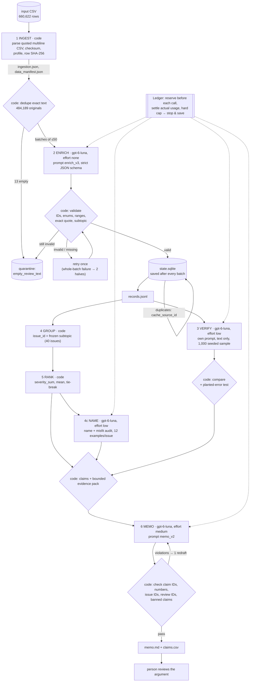

# Spotify review triage: a multi-agent pipeline over 660,622 reviews

**Question:** where should Spotify put next quarter's product effort: access, usability, playback, or billing/support?
**Answer ([memo](runs/full/memo.md)):** **billing/support**, specifically the free-tier paywall issues
(`billing.broad_paywall`, `billing.premium_only_controls`, `billing.free_song_choice`), which hold ranks 3–5 of 40 issues.
Their share of all reviews rose from **4.18 % to 13.94 %** between comparable six-month windows.

Every number in the memo is backed by a saved calculation ([claims.csv](runs/full/claims.csv)) that code checked, and by
review IDs in a bounded evidence pack. All of it can be inspected **without an API key**, and the ranking can be
regenerated without any model call.

> Full grading export (`grading.zip`, including the 80 MB `records.jsonl.gz`) and the interruption/resume screen recording are
> attached to the **[v1.0 release](../../releases/tag/v1.0)**. Every other grading file is in [`runs/full/grading/`](runs/full/grading/).

---

## 1. Results at a glance (final full-corpus run `runs/full`)

| Measure | Value | Evidence |
|---|---|---|
| Source rows ingested and accounted for | **660,622 / 660,622** (checksum `1fc85de6…cefb6` matches the manifest) | [ingestion_report.json](runs/full/ingestion_report.json), [self-check](evals/checker/self-check.json) |
| Successfully classified nonempty reviews | **660,608 / 660,609** (99.9998 %) | [run_summary.json](runs/full/run_summary.json) |
| Quarantined | **14** = 13 `empty_review_text` + 1 `degenerate_repetitive_text` ([§7.5](#75-a-failed-case-and-how-it-was-handled)) | [quarantine.jsonl](runs/full/quarantine.jsonl) |
| Exact-text cache reuse | **176,420** rows reuse the result of one of 484,189 distinct texts (`cache_source_id`) | grading `records.jsonl.gz` |
| Golden-50 agreement vs **my own labels** | topic **86 %** (92 % with my accepted alternatives), intent **94 %**, severity **90 %**, all three 76 % (80 %); severity MAE **0.12** | [golden_eval.md](evals/golden_eval.md) |
| Independent verifier (1,000 seeded random reviews) | topic 85.2 %, intent 92.7 %, severity 88.7 %, all three 74.2 %, severity MAE 0.131 | [disagreement_report.json](runs/full/verify/disagreement_report.json) |
| Planted wrong labels caught | **25 / 25** | [planted_error_test.json](runs/full/verify/planted_error_test.json) |
| Prompt-injection cases | **4 / 4** labeled by content; no neighbour pulled toward the injected labels | [injection_results.json](evals/injection/injection_results.json) |
| Model calls (all roles) | 10,041 logged attempts: 9,915 enrich (169 retries, 241 salvaged, 67 failed attempts), 100 verify, 23 group, 3 memo | [calls.jsonl.gz](runs/full/grading/calls.jsonl.gz) |
| **Actual API cost** | **$14.39** (full run incl. taxonomy discovery; OpenAI bill for all project work $15.67, see [§7.4](#74-development-checkpoints-and-cost-calculator)) measured usage × [rates](cost/rates.csv) (estimate before the run: $14.71 base / $22.96 conservative) | [run_summary.json](runs/full/run_summary.json), [cost report](cost/report.md) |
| Development spend (pilots, checkpoints, tests, aborted attempt) | **$0.66** | `runs/dev*`, `cost/`, `evals/injection/` |
| Elapsed (enrichment) | 5.6 h at 10 workers (the laptop lid was closed 02:21–≈06:10, so the Mac slept between brief wake-ups; see [§9](#9-limitations)) | [run_log.jsonl](runs/full/run_log.jsonl) |
| Interruption / resume | 97,222 IDs saved → Ctrl-C → resume added new IDs; **0** completed IDs re-sent | [§6](#6-recovery-interruption-and-resume), video in release |
| Zero-API checker | `working_coverage_point_candidate = 1.0`; one flag: `unfinished_classification: 1` (the quarantined review above) | [self-check.json](evals/checker/self-check.json) |

## 2. Rubric → evidence map

| Rubric criterion | Where to look |
|---|---|
| **D1 Accessible code/setup and artifacts** | [§3 Run it](#3-run-it); `requirements.txt`; `.env.example`; offline commands need no key |
| **D2 Architecture, shared schema, provenance** | [§4](#4-architecture); [labels.py](pipeline/labels.py) (schema + validation); `label_config` on every record and call; [data_manifest.json](runs/full/data_manifest.json); [prompts/](prompts/) + [CHANGELOG](prompts/CHANGELOG.md) |
| **D3 Memo numbers ↔ calculations ↔ sources** | [memo.md](runs/full/memo.md) cites `[Cnnn]` → [claims.csv](runs/full/claims.csv) → [ranking.csv](runs/full/ranking.csv) ← [membership.csv](runs/full/grading/membership.csv); code check [memo_check.json](runs/full/memo/memo_check.json); [§5 trace](#5-one-review-traced-end-to-end) |
| **D4 Recommendation, alternatives, limitations** | [memo.md](runs/full/memo.md); [§8](#8-ranking-and-the-recommendation); [§9](#9-limitations) |
| **T1 50 human labels, per-field comparison, error analysis** | [golden_labels.json](evals/golden_labels.json) (my raw export); [golden_eval.md](evals/golden_eval.md); [§7.2](#72-golden-set-error-analysis) |
| **T2 Independent verification, planted-error and injection tests** | [verify/](runs/full/verify/); [planted_error_test.json](runs/full/verify/planted_error_test.json); [injection_test.py](evals/injection_test.py) → [results](evals/injection/injection_results.json) |
| **T3 Validation, bounded retries, failure accounting, usage, recovery, cost calculator** | [tests/test_offline.py](tests/test_offline.py) (16 tests); [run_summary.json](runs/full/run_summary.json); [cost/](cost/) ([report](cost/report.md)); [§6](#6-recovery-interruption-and-resume) |
| **Learning focus: one failure explained in my own words** | [§7.5 → In my own words](#in-my-own-words) |
| **W1 Full ingestion, coverage, classification** | [§1](#1-results-at-a-glance-final-full-corpus-run-runsfull); [self-check.json](evals/checker/self-check.json) |
| **W2 Runnable staged program, bounded calls, saved handoffs, resume** | [run.py](run.py) (`all` or per stage); ≤ 50 reviews/call (checked: `unbounded_batch` never flagged); [checkpoints](runs/full/grading/); recording in release |
| **W3 Reproducible ranking, grounded output** | `python run.py rank --run runs/full` → byte-identical [ranking.csv](runs/full/ranking.csv) (also a unit test); [memo.md](runs/full/memo.md) |

## 3. Run it

```bash
git clone https://github.com/ankita-punjani/spotify-review-pipeline && cd spotify-review-pipeline
python3.13 -m venv .venv && .venv/bin/pip install -r requirements.txt   # openai 3.24.0, python-dotenv 1.2.4
```

**No API key needed (inspection and reproduction):**

```bash
.venv/bin/python -m unittest tests/test_offline.py        # 16 offline tests: validation, retries, spend cap, resume, ranking
.venv/bin/python cost/calculator.py                       # replay the 100-review cost/runtime calculator -> cost/report.md
.venv/bin/python run.py rank --run runs/full              # regenerate membership + baseline ranking from saved records*
```

\* `rank` reads `runs/full/records.jsonl`. Restore it from the release: `gunzip -c grading/records.jsonl.gz > runs/full/records.jsonl`.

**Zero-API grading check:** put the dataset CSV in `data/` (see [§10](#10-data)), unzip `grading.zip` from the release, then:

```bash
.venv/bin/python vendor/check_submission.py reference --full data/spotify_reviews_18months.csv --analysis data/spotify_reviews_18months.csv --out local-reference.json
.venv/bin/python vendor/check_submission.py check --reference local-reference.json --submission grading --out self-check.json
```

**Paid model runs (separate, explicit step).** Copy `.env.example` to `.env` and set `OPENAI_API_KEY`. Every command
takes a hard `--budget-usd` cap:

```bash
.venv/bin/python run.py all --input path/to/any.csv --run runs/new --budget-usd 5 --workers 4   # every stage on any CSV
.venv/bin/python cost/calculator.py pilot --yes          # the 100-review cold/warm pilot (~$0.007)
.venv/bin/python evals/injection_test.py --yes           # injection test (~$0.003)
```

Individual stages: `ingest`, `enrich` (`--max-batches`, `--workers`, `--rescue-transient`), `checkpoint`, `records`,
`verify`, `rank`, `group`, `memo`, `grading`. See `python run.py -h`. The full run used
`tools/resume_demo.sh` (ingest → enrich → Ctrl-C → checkpoint → resume) and then `tools/finish_full_run.sh`.

## 4. Architecture



| Stage | Owner | Input → output | Failure behaviour | Stop condition |
|---|---|---|---|---|
| 1 Ingest | code | CSV → `ingestion.json`, `ingestion_report.json`, `data_manifest.json` | malformed CSV raises (checker's strict parser) | all rows read |
| 2 Enrich | **model** (`enrich`) + code validation | ≤ 50 `{i, q, text}` items → validated records in `state.sqlite` | bounded backoff (4 attempts) for 429/5xx/timeouts; one retry for invalid items; salvage complete items from truncated output; quarantine with reason; quota/spend cap → stop and save | no pending originals, Ctrl-C, or budget |
| 3 Verify | **model** (`verify`) + code compare | review text only (never the first label) → `verifier_predictions.jsonl`, `disagreement_report.json` | failed items reported as missing | declared sample done |
| 4 Group | code; **model** (`group`) for discovery and naming | records → `membership.csv` (code); 12 quotes/issue → `issues.json` names + misfits (model) | model cannot change membership | top 15 issues named |
| 5 Rank | code | records + membership → `ranking.csv`, `aggregates.csv`, `topic_aggregates.csv`, `trend_monthly.csv` | n/a | deterministic |
| 6 Memo | **model** (`memo`) + code checks | aggregates + claims + ≤ 4 quotes per issue → `memo.md`, `claims.csv` | one redraft with the violations listed, then flagged for a person | passes checks |

**Why each model call exists, and what code does instead.** The model is used only where language must be read:
- labeling messy, multilingual review text
- re-reading text independently for verification
- proposing and naming issue groups
- writing prose

Code owns everything else: IDs, hashing, batching, dedupe, state, retries, spend, validation, membership, every count and
mean, the ranking, and checking each number the memo writes. One model (`gpt-6-luna`) serves all four roles, with
separate prompts, schemas, reasoning settings and saved inputs and outputs. Its default reasoning effort is *medium*, so
it is set explicitly per role:
- **none** for enrichment (cheapest)
- **low** for verification and naming
- **medium** for the single memo call

**Shared schema** (`grading/records.jsonl`): `review_id, source_sha256, status, topic, intent, sentiment, severity, entities,
evidence_quote, needs_review, label_config`, plus `subtopic` and `cache_source_id`. `label_config =
gpt-6-luna+enrich_v3+schema_v2+effort-none+val2` pins model, prompt, schema, effort and validator versions. Cache reuse is
allowed only under an identical config.

**Design choices worth knowing:**
- **Reviews of ≤ 120 characters are their own evidence quote.** The model quotes only longer ones; quotes are checked as
  exact substrings. If the model "fixes" a typo in its quote ("awesome" for "awsomw"), code maps it back to the exact source
  span (≥ 0.8 similarity). Nothing is invented: all 660,608 quotes are exact substrings (checker).
- **Local indices 1–50 in prompts instead of 36-character UUIDs.** This saves about 10 M input tokens; code maps every
  returned index back to its `review_id` and validates it.
- **Issue taxonomy discovered first, then frozen.** The `group` role proposed subtopics from a seeded sample of
  development complaints ([proposal](taxonomy/discovery_v1/proposal.json)). they were curated (with my AI coding assistant) and frozen
  ([subtopics_v1.json](taxonomy/subtopics_v1.json); every change is listed in it), and enrichment then tags each complaint
  in the single full pass. Issue membership is pure code, so re-ranking never needs a model.
- **Severity consistency rule in code.** Praise, request and unclear are forced to severity 1, per the shared definition;
  each override is logged in the record notes.

## 5. One review traced end to end

| Step | Artifact | Value |
|---|---|---|
| Source | CSV row `040ea877-66f1-41c7-bac7-d3b09496f261` | "It was a pretty good app but now I can't see lyrics, it asks for premium, very annoying" (1★, 8.8.66.563, 2023-09-10) |
| Row hash | `source_sha256` | `36236b0f…dd2ac5a70` (checker's `row_sha`) |
| Enrichment | call `resp_0baf1e0a…` (phase `resume`, 50 reviews) → record | billing / complaint / severity 3 / sentiment −0.6 / subtopic `billing.premium_only_controls` / quote = full text (≤ 120 chars) / entities `lyrics, premium` |
| Verification | call `resp_016dc3a3…` (10 reviews, text only) | billing / complaint / severity 3 / −0.7, so it **agrees** (verifier marked itself not confident) |
| Issue membership | `membership.csv` | `billing.premium_only_controls,040ea877-…` |
| Ranking | `ranking.csv` row 4 | complaint_count 18694, severity_sum 56084, mean 3.000107, priority 56084 |
| Memo claim | `claims.csv` | `C013` complaint_count = 18694, `C016` priority_score = 56084, both cited in [memo.md](runs/full/memo.md) |

(Lyrics locked behind Premium is a Premium-only restriction, which the contract places under **billing**, not catalog.)

## 6. Recovery: interruption and resume

The full run itself was interrupted ([`tools/resume_demo.sh`](tools/resume_demo.sh); the screen recording is in the release):

1. **Initial phase:** 10 workers for 90 s classified 3,050 originals. With exact-text reuse that covers **97,222** completed
   IDs → Ctrl-C (SIGINT). In-flight batches finished and were saved → [`checkpoint_before.json`](runs/full/grading/checkpoint_before.json).
2. **Resume, unchanged settings:** phase `resume`, skipped all 97,222 → [`checkpoint_after.json`](runs/full/grading/checkpoint_after.json)
   70 s later had 98,972 (+1,750). **0** IDs from the before-checkpoint appear in any resume call
   ([`tools/resume_check.py`](tools/resume_check.py)). The resume then ran to completion. Session table:
   [run_summary.json](runs/full/run_summary.json).
3. **Unplanned recoveries:**
   - A development run stalled and was killed by a time limit. It resumed from 1,350 saved records, and I added a stall
     watchdog and a structured run log.
   - In the full run the laptop lid was closed for about 4 h, so macOS slept. Work continued during dark-wake windows, and timed-out calls
     (60 `APITimeoutError`s over the run) were retried by bounded backoff.
   - A first full-run attempt was stopped by closing its terminal tab after 500 reviews ($0.0135). It was set aside in
     [`runs/full_aborted_1`](runs/full_aborted_1/) rather than mixed into the final run.

Spend controls:
- a `Ledger` reserves the worst-case cost of each call before dispatch and settles actual usage after it
- the code cap was $25, with an OpenAI project hard limit of $50 behind it
- the account quota (`insufficient_quota`) stops the run instead of retrying
- all three are covered by offline tests

## 7. Evaluation and failures

### 7.1 Golden 50 (human labels)
I labeled all 50 in [a local form](tools/label_golden.html):
- **star ratings were hidden**
- the definitions sat beside every review
- labels were exported **before** I saw any model output on these reviews
- the labels were never used in prompts, examples, thresholds or taxonomy discovery

All prompt revisions were driven by development data ([CHANGELOG](prompts/CHANGELOG.md)). The golden reviews' texts are
classified in the normal full run. I marked 16 as ambiguous; in 7 of them I wrote accepted alternatives in the note
("also accept billing / sev 4"), which [golden_eval.py](evals/golden_eval.py) parses from my own wording.

| field | strict | accepting my alternatives |
|---|---:|---:|
| topic | 86 % | 92 % |
| intent | 94 % | 94 % |
| severity (exact) | 90 % (MAE 0.12) | 90 % |
| all three | 76 % | 80 % |

Other measures:
- **Macro-F1 (checker, singleton cases):** topic 0.75, intent 0.85, severity 0.85.
- **Sentiment:** MAE 0.25, and 66 % within the predeclared ±0.3. My labels used 5 coarse levels, the model one decimal.
- **Quotes:** 50/50 are exact substrings.
- **Entities:** the model listed 43 vs my 19, 13 overlapping, and **0** model entities absent from the text. It is generous
  but grounded.
- **Small sample:** 50 cases is a diagnostic, not a population estimate. One disagreement moves topic agreement by 2 points.

### 7.2 Golden-set error analysis
All 12 strict disagreements are in [golden_eval.md](evals/golden_eval.md). They fall into five patterns:
1. **Free-tier limits: billing vs usability/playback (3 cases).** "Ads were okay, but limited functionality", "I can't even
   play the songs I like… can't rewind" and "Too expensive and the free version is… unusable with constant ads". This is
   the same boundary the independent verifier disagreed on most (billing→usability, 28 of 1,000), and it is the boundary
   the recommendation depends on. See §8 for why the conclusion is robust to it.
2. **Vague praise defaulted to `other` (2).** "Spotify is awesome and very diverse" (I said catalog) and "Duo Premium…
   No ads at all!" (I said usability). The model is conservative about naming a specific praised feature. This doesn't
   touch the ranking, because praise is not ranked.
3. **Non-English and slang (2).** "Please ye ads ko thoda kumm karo" (Hindi, "please reduce the ads"): the model said
   *request*, I said *complaint*. "Bheekhmangon" ("beggars"): the model said *unclear*, I said *complaint*. Both are defensible.
4. **Severity off by one (2).** A political rant about banned songs (I said 1, the model 3); "plays a little bit then it
   stops" (I said 4, the model 3).
5. **Where I may be the one who is wrong (1).** "…I can't even open the app" was labeled *access* by me and *playback* by
   the model. The contract puts "app won't open / crashes" under playback, so the model applied the definition more
   literally than I did.

**`needs_review` as a predictor:** flagged reviews fell outside my accepted labels 33 % of the time vs 17 % for unflagged
(3/9 vs 7/41), and disagreed with the verifier 39 % vs 23 % (60/152 vs 198/848). It is a useful but weak signal and is
treated as such.

### 7.3 System tests (actual outcomes)

| Test | Outcome |
|---|---|
| Independent verifier, 1,000 seeded random originals | numbers in §1; top topic confusions billing↔usability 28, other→catalog 16, other→playback 15 |
| Planted wrong labels (separate in-memory copy, 25 records) | 25/25 flagged; saved records untouched |
| Prompt injection (4 synthetic reviews inside a real batch + a control batch) | 4/4 labeled by content; 2 of 16 neighbours differed from control, neither toward praise/billing/severity 5 |
| Malformed / truncated / junk-suffixed output | 241 full-run calls salvaged (complete items kept, missing ones retried); first-try invalid rate fell from 4.9 % to 0.1 % after the dev-driven validator v2 |
| Temporary API failure, rate limit, quota, spend cap | offline tests with a fake client (bounded 4 attempts; quota → stop; cap refuses before calling) |
| Interruption / resume | §6 |
| Re-ranking reproducibility | `rank` twice → byte-identical; equals the checker's recomputation |
| Memo claim check | the model's first full-run draft mentioned "revenue" → rejected by code → redraft passed. My review then found 3 problems the mechanical check can't see (below), so the final memo is a plain-language rewrite that passes the same check (18 claims) |

### 7.4 Development checkpoints and cost calculator
- **Checkpoints, in order:** smoke 50, 500, 10,000 (and a 2,000 diagnostic). Each one changed something; see
  [CHANGELOG](prompts/CHANGELOG.md).
- **[cost/report.md](cost/report.md):** the required 100-review cold/warm pilot. Cold run: $0.0066 for 100 reviews in 88 s.
  Warm run: **0 calls, $0**.
- **Arithmetic:** the full-run estimate is computed from `usage.csv` × `rates.csv`. Doubling a rate doubles the API subtotal.
- **Estimate vs actual:** the projected $14.71 base came in at **$14.39** actual.
- **Logs vs OpenAI bill:** OpenAI's billing page shows **$15.67** used on this project (of $45 bought, $29.33 left), while my
  logs add up to **$15.06** ($14.39 full run, $0.66 development, $0.01 demo rehearsal). The $0.61 gap is most likely:
  - the 60 calls that timed out mid-response, which OpenAI probably still billed but which my code logged at $0 because no
    usage came back
  - a few calls cut off when the first full-run attempt was stopped

  So the real cost is about 4 % higher than the logged cost.

### 7.5 A failed case and how it was handled
Review `98595c6f-dfb3-4c1d-82af-949d9ffb7346` is "Ist very very very …", about 100 repetitions of "very". It was sent in
6 enrichment calls across sessions 2–4, and **5 of them ended in a repetition loop**: the model kept copying "very very…"
into the evidence quote until it hit the 7,000-token output cap. Each time:
- the response was cut off (`status_incomplete:max_output_tokens`)
- code salvaged the other reviews' complete answers and re-sent only the missing ones

The sixth call returned a quote with the wrong number of "very"s, so it failed the exact-substring check. The last attempt
was an opt-in rescue (`--rescue-transient`), allowed because the first failures were incomplete calls rather than invalid
answers.

**Decision:** keep it **quarantined**, not labeled, with an exact backend tag. The original automatic reason
(`invalid_after_retry:call_failed|missing_from_output`) was vague, so after reviewing `calls.jsonl` and
`invalid_items.jsonl` I replaced it ([tools/tag_quarantine.py](tools/tag_quarantine.py); the old reason is kept in
`run_log.jsonl`) with:
`degenerate_repetitive_text: output loop in 5 of 6 calls (7000-token cap), 1 quote_not_in_source; no valid label`.
It is the only unclassified nonempty review and is disclosed in the memo's coverage line.

**Scope of the problem:** 79 enrichment calls hit the output cap in the full run, and this review accounts for 5 of them.
All capped calls together cost $0.28 of output, about 2 % of the run. The salvage logic kept their complete items, so no
other review was lost.

#### In my own words
The failure I'd point to is a review that is just "Ist very very very…" about a hundred times. It's meaningless, harmless
text, but it broke the model. Every time it was in a batch, the model started copying "very very very" into the evidence
quote and couldn't stop until it ran out of output space. That cut off the answers for the other reviews in the same
batch, so they had to be rescued from the partial response or sent again. It happened in 5 of the 6 calls that included it.

The pipeline handled it the way I designed it to. Code noticed the broken response each time, kept every complete answer
for the other reviews, retried only what was missing, and after the allowed retries it stopped and quarantined the review
instead of forcing a label. I then read the call log and replaced the vague automatic reason with an exact tag,
`degenerate_repetitive_text`, so anyone auditing the data can see why that one review has no label.

What I learned is that the costly failures weren't the hard, ambiguous reviews; they were strange inputs that make the
model loop. Next time I'd add a cheap code check before calling the model: if a review is mostly one word repeated, route
it straight to `other / unclear / severity 1` (or to quarantine) without a model call. That saves the tokens and protects
the other 49 reviews in its batch.

## 8. Ranking and the recommendation
**Baseline (required):**
- Uses completed `complaint` and `cancellation` records only; each belongs to exactly one issue.
- `complaint_count` = members.
- `priority_score = severity_sum = complaint_count × mean_severity`.
- Means are given to 6 decimals, rounded half-up.
- Sorted by score descending, then `issue_id` ascending.

That gives 292,693 ranked complaints in 40 issues ([ranking.csv](runs/full/ranking.csv)). Extra, clearly separate tables:
- [aggregates.csv](runs/full/aggregates.csv): cancellations, severity ≥ 4, helpful votes, share
- [topic_aggregates.csv](runs/full/topic_aggregates.csv)
- [trend_monthly.csv](runs/full/trend_monthly.csv): monthly shares **with denominators**; the first and last months are
  flagged partial

The memo compares the first and last six *full* months (2022-06..2022-11 vs 2023-05..2023-10).

Why billing, as the memo argues:
- **The top issue isn't actionable.** `other.general` ("bad app", nothing specific) ranks #1.
- **Billing leads the actionable issues.** After usability's ad complaints (#2), the three free-tier paywall issues rank
  #3–#5. Their combined billing share of all reviews **more than tripled** between the comparable windows, while the
  usability and playback shares fell.

**Robustness to the main label ambiguity:** the billing↔usability boundary (§7.2) could move some complaints between
those two topics. But the trend comes from the rise in Premium-restriction complaints in 2023, which shows up in all three
billing issues. Moving even several thousand complaints from billing to usability would not reverse a rise from 4.18 % to
13.94 %. Usability's ad interruptions (#2) remain the strongest alternative, and the memo says so.

## 9. Limitations
- **Self-selected public reviews.** They are not a representative sample of users. "Cancellation" is *expressed intent*;
  there is no revenue, plan, churn or causal data, and the memo makes no such claims (code-checked).
- **Labels are imperfect.** About 74–80 % joint agreement on topic, intent and severity with an independent re-labeler and
  with me; 94,057 completed records carry `needs_review`.
- **Two windows of different sizes** (175,708 vs 301,434 reviews); the first and last calendar months are partial; 159,701
  rows lack an app version.
- **One model provider** serves all roles. Independence comes from a separate prompt, a separate reasoning setting and a
  text-only input, not a different model.
- **Elapsed time** includes about 4 h of intermittent laptop sleep (lid closed). Measured throughput was about 40 batches/min at 10 workers under the
  tier-1 500 k TPM limit.
- **Mechanical checks don't catch everything.** The model drafted the memo ([memo_draft_1.md](runs/full/memo/memo_draft_1.md),
  [memo_draft_2.md](runs/full/memo/memo_draft_2.md)) and the draft passed every number check, but my review still found three problems:
  - a false comparison: it said playback had the highest average severity, but access is higher
  - a cited "paywall" review that was really about a lost playlist; the evidence pick takes the most severe reviews first, and
    some of those are misfiled lost-library complaints
  - support was never addressed

  The final [memo.md](runs/full/memo.md) is my approved plain-language rewrite. It uses only numbers from the saved
  pack and was re-checked by the same code. All edits are logged in [memo_check.json](runs/full/memo/memo_check.json).

## 10. Data
BwandoWando, *3.4 Million Spotify Google Store Reviews*, v2 (Kaggle, CC0), course extract May 2022 – Nov 2023.
`spotify_reviews_18months.csv`: 97,400,616 bytes, SHA-256 `1fc85de68a304dd8978b537cfa58793d5f41cbaf417fa32cb53899f83a2fcef6`.
It is not committed: download the course ZIP and place the files in `data/`. The development files `cost_100.csv`,
`checkpoint_500.csv`, `analysis_10000.csv` and `golden_50_to_label.csv` go in the same folder.

## 11. Repository map
```
run.py                     CLI: ingest, enrich, checkpoint, records, verify, rank, group, memo, grading, all
pipeline/                  io, ingest, labels (schema+validation), llm (spend ledger, retries, call log), enrich,
                           discover, verify, rank, group, memo, records, export, summary
prompts/                   enrich_v1..v3, verify_v1, discover_v1, name_v1, memo_v1..v2, CHANGELOG.md
taxonomy/                  discovery proposal + frozen subtopics_v1.json (40 issue IDs)
runs/full/                 final run: summaries, logs, ranking/aggregates, verify/, memo/, issues.json, grading/
runs/dev*, runs/diag*      500 / 10,000 / 2,000 development checkpoints (state DBs omitted)
cost/                      100-review calculator, pilot calls/usage, rates, assumptions, report.md
evals/                     golden labels + evaluation, injection test, checker self-checks
tests/test_offline.py      16 offline tests
tools/                     labeling form, resume demo, finishing script, resume check
vendor/check_submission.py course checker (unchanged), used for row hashing and self-checks
```

*Built with Claude Code (AI coding assistant) under my direction. The golden labels are my own, made before I saw any model output on those reviews.*
